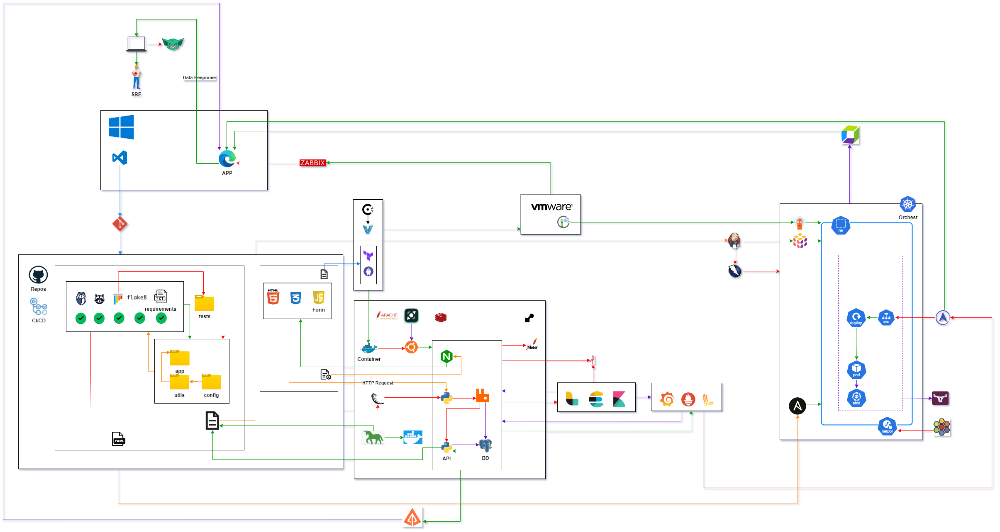
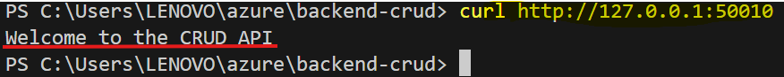
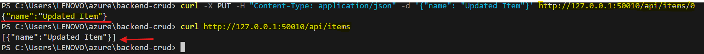
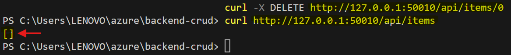

# Architecture Guide

## Contents

- [Architecture Guide](#architecture-guide)
  - [Contents](#contents)
  - [⚙️ System Overview](#️-system-overview)
  - [📊 Diagram](#-diagram)
  - [🔗 Component Interactions](#-component-interactions)
    - [1. User Registration](#1-user-registration)
    - [2. Fetching User Details](#2-fetching-user-details)
    - [3. Updating User Information](#3-updating-user-information)
    - [4. Deleting a User](#4-deleting-a-user)
  - [⚠️ Critical Points and Scaling](#️-critical-points-and-scaling)
    - [Examples of Load Distribution Among Servers](#examples-of-load-distribution-among-servers)
    - [How Redis Enhances Performance](#how-redis-enhances-performance)
  - [📈 Data Flow](#-data-flow)
    - [Flow Diagram](#flow-diagram)
    - [CRUD Operations Summary](#crud-operations-summary)
  - [🔄 Overall Flow Explained](#-overall-flow-explained)
    - [Emphasizing Real-Time Data Updates](#emphasizing-real-time-data-updates)
    - [🚀 CI/CD Pipeline with GitHub Actions](#-cicd-pipeline-with-github-actions)
      - [1. **Setting Up the Workflow File**](#1-setting-up-the-workflow-file)
      - [2. **Running Unit Tests**](#2-running-unit-tests)
      - [3. **Building the Docker Image**](#3-building-the-docker-image)
      - [4. **Deployment to Render**](#4-deployment-to-render)
      - [5. **Notifications**](#5-notifications)
    - [Final Considerations](#final-considerations)
  - [🎯 Overall Goals and Benefits](#-overall-goals-and-benefits)
  - [📊 Critical Metrics for End-to-End System Health and Performance](#-critical-metrics-for-end-to-end-system-health-and-performance)
    - [Suggested Tools for Monitoring Critical Metrics](#suggested-tools-for-monitoring-critical-metrics)
    - [Suggested Metrics to Monitor](#suggested-metrics-to-monitor)
  - [📈 Monitoring and Logging](#-monitoring-and-logging)
    - [Metrics to Log](#metrics-to-log)
    - [Accessing Logs](#accessing-logs)
  - [🚧 Error Handling and Rollback](#-error-handling-and-rollback)
    - [1. Error Detection](#1-error-detection)
    - [2. Error Handling in Flask](#2-error-handling-in-flask)
    - [3. Rollback Strategy](#3-rollback-strategy)
      - [Database Transactions](#database-transactions)
    - [4. Testing and Validation](#4-testing-and-validation)
      - [Automated Testing](#automated-testing)
      - [Staging Environment](#staging-environment)
    - [5. User-Friendly Error Responses](#5-user-friendly-error-responses)
      - [Custom Error Pages](#custom-error-pages)
      - [Graceful Degradation](#graceful-degradation)
    - [6. Post-Mortem Analysis](#6-post-mortem-analysis)
      - [Root Cause Analysis](#root-cause-analysis)
  - [➡️ Security](#️-security)
    - [Types of Validations](#types-of-validations)
    - [Authentication Techniques](#authentication-techniques)
  - [✏️ Additional Considerations](#️-additional-considerations)

## ⚙️ System Overview

- **Target Audience**:

  - This architecture is aimed at fullstack developers teams who require robust data processing and analysis capabilities.

- **Use Case**:

  - The system is a CRUD application, which is a fundamental feature in any system.

  - The interface is developed using common technologies, while the backend uses **Flask** to process information.

  - Everything runs inside **Docker containers**, which are like small capsules that keep the system functioning without external interference, and orchestrated using Docker Compose.

  - The production environment is deployed via **Render**, and **GitHub Actions** is used for continuous integration and deployment (CI/CD).

- **Site Reliability Engineering (SRE) Integration**:

  - Integrating principles ensures reliable, available, and high-performance systems, enhancing operational efficiency and the end-user experience.

## 📊 Diagram

This diagram visualizes how the components of the system interact. The browser where you click a button communicates with a server (backend) that manages all the business logic. The information you see is stored in a database.

1. **Backend (Flask API)**.
2. **Database (PostgreSQL or JSON for local testing)**.
3. **Render (Cloud Deployment)**.
4. **Docker Compose (Service Orchestration)**.

Use tool **draw.io**, to create this diagram.



## 🔗 Component Interactions

The components of the system work together: when you make a request, such as registering an account or viewing information, the browser sends that request to the server (backend), which processes it. The server then retrieves or saves the information in a database and sends a response back to your screen.

- The browser makes HTTP requests to the Flask backend.

- Flask handles these requests, interacts with the database, and returns responses.

- **Docker Compose** ensures that all these pieces are coordinated.

### 1. User Registration



- **HTTP Request**:
  - **Method**: POST
  - **Endpoint**: `/api/register`
  - **Request Body** (JSON):

    ```json
    {
      "username": "newuser",
      "password": "securepassword"
    }
    ```

- **Expected Response**:
  - **Status Code**: 201 Created
  - **Response Body** (JSON):

    ```json
    {
      "message": "User registered successfully",
      "user_id": 123
    }
    ```

### 2. Fetching User Details

- **HTTP Request**:
  - **Method**: GET
  - **Endpoint**: `/api/users/123`

- **Expected Response**:
  - **Status Code**: 200 OK
  - **Response Body** (JSON):

    ```json
    {
      "user_id": 123,
      "username": "newuser",
      "created_at": "2024-01-01T12:00:00Z"
    }
    ```

### 3. Updating User Information



- **HTTP Request**:
  - **Method**: PUT
  - **Endpoint**: `/api/users/123`
  - **Request Body** (JSON):

    ```json
    {
      "username": "updateduser"
    }
    ```

- **Expected Response**:
  - **Status Code**: 200 OK
  - **Response Body** (JSON):

    ```json
    {
      "message": "User updated successfully"
    }
    ```

### 4. Deleting a User



- **HTTP Request**:
  - **Method**: DELETE
  - **Endpoint**: `/api/users/123`

- **Expected Response**:
  - **Status Code**: 204 No Content
  - **Response Body**: None

## ⚠️ Critical Points and Scaling

As the system grows in user numbers, it may face certain limits, such as how many requests it can handle simultaneously or the amount of data it can process. We can scale the system by adding more servers (load balancing) or using techniques like caching to speed up processing. Below are specific of how to implement these strategies:

### Examples of Load Distribution Among Servers

1. **Load Balancer**:

   - Implementing a load balancer, such as **Nginx**, allows for distributing incoming requests across multiple backend server instances. This not only helps manage a higher volume of traffic but also improves system availability and resilience.

   - If the system receives a large number of simultaneous requests, the load balancer can send the first 50 requests to one Flask instance, the next 50 to another, and so forth. This ensures that no single instance becomes overwhelmed, which could lead to slow response times or server crashes.

2. **Horizontal Scaling**:

   - Horizontal scaling involves adding more instances of the backend service. For instance, if the system initially runs on a single Flask instance and starts experiencing increased traffic, you can add two or three additional instances.

   - Using **Kubernetes** to manage these containers allows the system to dynamically adjust to load. When demand increases, the system can automatically launch more instances.

### How Redis Enhances Performance

1. **Caching Results**:

   - Redis can be utilized as a caching system to store the results of frequent database queries. This reduces response times and decreases load on the database. For instance, if a database query is time-consuming and frequently executed, storing that result in Redis allows for much quicker retrieval.

   - Consider a scenario where the system queries user data that doesn't change often. Storing this data in Redis means that whenever it's needed, the system can retrieve it from Redis instead of querying the database, which can be thousands of times faster.

2. **Session Management**:

   - Using Redis to handle user sessions is another way to improve performance. Redis provides extremely fast access to session data, which is critical for applications requiring a smooth user experience.

   - In an e-commerce application, when a user adds products to their cart, that information can be stored in Redis, allowing for quick retrieval and improving user experience.

3. **Pub/Sub (Publish/Subscribe)**:

   - Redis also allows for implementing messaging patterns like Pub/Sub, which can help decouple components and enhance scalability. If multiple services need to communicate, Redis can be used to send messages between them, preventing one component from having to wait for another’s response.

   - A notification service can publish messages via Redis whenever a record in the database is updated, allowing other services to listen for these events and react accordingly without delaying processing.

## 📈 Data Flow

The information flows simply: users interact with the system from the frontend, which sends requests to the backend. The backend manages these requests (saving a new record in the database) and finally sends a response to the interface.

1. Users interact with the frontend.
2. Requests are sent to the backend.
3. The backend performs CRUD operations on the database.
4. The backend sends the response back to the frontend.

### Flow Diagram


```plaintext
[ User Interacts ]
         |
         v
[ Send HTTP Request ]
         |
         v
    +-----------------+
    |      Backend    |
    |                 |
    |  +----------+   |
    |  |   Create |   |
    |  +----------+   |
    |  +----------+   |
    |  |    Read  |   |
    |  +----------+   |
    |  +----------+   |
    |  |  Update  |   |
    |  +----------+   |
    |  +----------+   |
    |  |  Delete   |  |
    |  +----------+   |
    +-----------------+
         |
         v
[ Send Response ]
         |
         v
[ Interface Updated ]

```

### CRUD Operations Summary

| Operation | Description                                 | HTTP Method | Example Endpoint  |
|-----------|---------------------------------------------|-------------|-------------------|
| Create    | Adds a new record to the database           | POST        | `/api/users`      |
| Read      | Retrieves records from the database         | GET         | `/api/users/{id}` |
| Update    | Modifies an existing record in the database | PUT         | `/api/users/{id}` |
| Delete    | Removes a record from the database          | DELETE      | `/api/users/{id}` |

## 🔄 Overall Flow Explained

The overall flow of the application involves a cyclical process of user interactions, HTTP requests, data processing, and response generation. This ensures that users receive timely updates and an interactive experience.

1. **User Interaction**:

   - The process begins when users interact with the frontend through actions like submitting forms, clicking buttons, or navigating between pages.

2. **HTTP Request**:

   - Upon user action, the frontend constructs an **HTTP request**. This request specifies the operation type (GET, POST, PUT, DELETE), the API endpoint, and any necessary data (form inputs).

3. **Request Handling by Backend**:

   - The request is sent to the **Flask backend**, which processes it based on the defined routes and HTTP methods. If data retrieval is required, Flask queries the database (PostgreSQL).

4. **Data Processing**:

   - The backend performs CRUD operations based on the request:

     - **Create**: Inserts new records into the database.

     - **Read**: Retrieves records from the database.

     - **Update**: Modifies existing records.

     - **Delete**: Removes records.

   - To ensure real-time updates, techniques such as **WebSockets** or **Server-Sent Events** can be utilized, allowing users to see current data without refreshing.

5. **Response Generation**:

   - After processing the request, the Flask backend constructs an **HTTP response**, which includes a status code (200 for success) and any relevant data (JSON results).

6. **Response to Frontend**:

   - The response is sent back to the frontend, where JavaScript processes the data and updates the user interface accordingly.

7. **User Feedback**:

   - The updated information is presented to the user, completing the cycle. This ensures a seamless experience, providing immediate feedback based on user actions.

### Emphasizing Real-Time Data Updates

- To implement real-time data updates, consider the following methods:

  - **WebSocket Connections**: Enable full-duplex communication for immediate data transmission.

  - **Polling**: Periodically check for updates, though less efficient than WebSockets.

  - **AJAX Requests**: Use AJAX for asynchronous updates that modify parts of the webpage without a full reload.

### 🚀 CI/CD Pipeline with GitHub Actions

Continuous Integration and Continuous Delivery (CI/CD) is a vital process to ensure that code changes are integrated quickly and reliably. Below are the detailed steps of the CI/CD pipeline using GitHub Actions:

#### 1. **Setting Up the Workflow File**

- Create a YAML file in the `.github/workflows` directory of your repository. This file defines the configuration for the CI/CD workflow.

#### 2. **Running Unit Tests**

- After installing dependencies, the next step is to run unit tests to ensure the code functions as expected.

#### 3. **Building the Docker Image**

- The application runs in containers, build the Docker image.

#### 4. **Deployment to Render**

- The tests pass and the image builds successfully, deploy the application to Render.

#### 5. **Notifications**

- Add notifications to alert the team about the status of the deployment. This can be done using integrations with Slack, email.

### Final Considerations

- **Secret Management**: Use GitHub Secrets to store sensitive information like API keys.

- **Docker Versioning**: Tagging Docker images with the commit version number for better tracking.

## 🎯 Overall Goals and Benefits

The architecture's primary goals include **scalability** and **flexibility**, which are crucial for ensuring that the system can handle growth and adapt to changing needs. Here are some examples of how these goals translate into performance improvements:

1. **Scalability**:

   - **Load Balancing**: By distributing incoming requests across multiple servers, the system can handle more concurrent users without performance degradation. For example, using a load balancer like Nginx or AWS Elastic Load Balancing can significantly improve response times during peak traffic periods.

   - **Horizontal Scaling**: The ability to add more instances of services (like Flask apps or database replicas) allows the system to accommodate increases in user demand. For instance, if a sudden spike in traffic occurs, deploying additional Docker containers can help maintain performance without downtime.

2. **Flexibility**:

   - **Adaptable Tech Stack**: The use of Docker makes it easy to switch out components of the system as needed. If a more efficient database technology emerges, it can be integrated without significant changes to the entire application.

   - **Microservices Architecture**: Transitioning to a microservices architecture in the future allows for independent scaling and deployment of different system parts. For example, if the user authentication component becomes a bottleneck, it can be scaled independently from other services, leading to improved overall performance.

## 📊 Critical Metrics for End-to-End System Health and Performance

To ensure the system functions well, we measure indicators like response time, success rate of requests, and resource usage like memory and CPU. These metrics help us identify problems before they affect users.

### Suggested Tools for Monitoring Critical Metrics

1. **Prometheus**:

   - **Functionality**: An open-source monitoring and alerting toolkit that is widely used for recording real-time metrics and providing alerting capabilities.

   - **Usage**: Set up Prometheus to scrape metrics from your Flask application and visualize them using Grafana.

   - **Documentation**: [Prometheus](https://prometheus.io/docs/introduction/overview/)

2. **Grafana**:

   - **Functionality**: A powerful visualization tool that integrates with various data sources, including Prometheus and Elasticsearch.

   - **Usage**: Create dashboards that display your API response times, success/failure rates, and resource usage.

   - **Documentation**: [Grafana](https://grafana.com/docs/grafana/latest/)

3. **Elastic Stack (ELK)**:

   - **Functionality**: Comprises Elasticsearch, Logstash, and Kibana for log management and analysis.

   - **Usage**: Aggregate logs from your application and visualize the data to monitor health and performance.

   - **Documentation**: [Elastic Stack](https://www.elastic.co/what-is/elk-stack)

### Suggested Metrics to Monitor

- **API Response Time**: Measure the average time it takes for your API to respond to requests.

- **Success/Failure Rate of Requests**: Track how many requests are successful versus those that fail, providing insights into potential issues.

- **CPU and Memory Usage**: Monitor resource consumption in your cloud environment (e.g., Render), which can impact performance.

## 📈 Monitoring and Logging

Critical components in application management, allowing developers and administrators to proactively identify and resolve issues, optimize performance, and ensure system availability. Below are specific examples of metrics you might consider logging and ways to access these logs.

### Metrics to Log

1. **API Performance Metrics**:

   - **Response Time**: Measures the time it takes for the server to process a request and send back a response.

   - **Request Success Rate**: Percentage of requests completed successfully versus the total requests made.

   - **Error Types**: Logs the number of errors (500, 404.) generated during requests.

2. **Resource Usage Metrics**:

   - **CPU and Memory Usage**: Monitors how many server resources are being utilized, which is crucial for detecting bottlenecks.

   - **Database Connections**: Number of active connections and utilization rate of those connections.

3. **User Activity Metrics**:

   - **Number of Active Users**: Count of users interacting with the application within a specified time frame.

   - **Feature Access Frequency**: How often specific functions or endpoints are accessed.

4. **Security Metrics**:

   - **Failed Access Attempts**: Number of login attempts that fail, which could indicate a potential attack.

### Accessing Logs

1. **Application Logs (Flask)**:

   - **Flask Logging**: Flask has a built-in logging system that allows you to log information about each request. You can configure the level of detail (INFO, ERROR, DEBUG) in your application.

   - **Access**: Logs can be stored in a file or sent to an external service for analysis, such as **Loggly** or **Papertrail**.

2. **Container Logs (Docker)**:

   - **Docker Logs**: You can access the logs of a container using the command `docker logs <container_id>`, which allows you to see standard output and errors generated by the application.

   - **Remote Access**: Tools like **ELK Stack (Elasticsearch, Logstash, Kibana)** enable aggregation and visualization of logs from multiple containers in one place.

3. **Monitoring Tools**:

   - **Grafana and Prometheus**: These tools can be integrated to provide real-time visualizations of specific metrics. Prometheus collects and stores metrics, while Grafana allows you to create customizable dashboards.

   - **Dashboard Access**: Through a web interface, you can monitor the state of your application and set alerts based on defined thresholds.

## 🚧 Error Handling and Rollback

Effective error handling and rollback strategies are crucial for maintaining system stability and user experience. Below are detailed steps to manage errors and implement rollback mechanisms.

### 1. Error Detection

- **Logging**: Implement robust logging using Python's built-in `logging` module to capture exceptions and relevant information at various levels (INFO, WARNING, ERROR).

- **Monitoring**: Use tools like **Grafana** or **Prometheus** for real-time monitoring and anomaly detection.

### 2. Error Handling in Flask

- **Global Error Handlers**: Define global error handlers to catch unhandled exceptions and respond with appropriate HTTP status codes.

- Wrap critical operations in **try-except** blocks to handle exceptions gracefully. This approach helps prevent the entire application from crashing due to unforeseen errors. Here’s how to implement it:

### 3. Rollback Strategy

#### Database Transactions

Ensuring atomicity in database operations is essential for maintaining data integrity, especially in scenarios where multiple operations must succeed or fail as a unit. Implementing transactions allows you to roll back changes in case of errors, thus preserving the consistency of the database.

1. **Begin a Transaction**: Start a new transaction before performing any database operations.

### 4. Testing and Validation

#### Automated Testing

- **Unit and Integration Tests**: Implement unit and integration tests using frameworks like **pytest** to ensure code quality. Automated tests help catch bugs early and verify that the application behaves as expected.

  - Create a suite of tests for API endpoints to confirm they return the expected responses for valid and invalid requests.

#### Staging Environment

- **Utilize a Staging Environment**: Before deploying new features to production, test them in a staging environment that mirrors the production setup. This practice minimizes the risk of introducing errors into the live application.

  - Set up a separate instance of the application where features can be tested in a controlled environment.

### 5. User-Friendly Error Responses

#### Custom Error Pages

- **Meaningful Error Messages**: Provide users with meaningful error messages instead of generic ones. Tailor messages to be informative and guide users on what steps to take next.

  - Instead of a generic "404 Not Found" page, provide a message that explains what the user was trying to access and suggest possible next steps.

#### Graceful Degradation

- **Limited Functionality During Failures**: Ensure that some core functionalities remain available even during partial system failures. This approach enhances user experience and trust in the application.

  - Feature fails, provide a fallback option that allows users to continue with other parts of the application.

### 6. Post-Mortem Analysis

#### Root Cause Analysis

- **Conduct a Post-Mortem**: After an error occurs, perform a thorough investigation to identify the root cause of the issue. Document findings and lessons learned to prevent similar issues in the future.

  - After a deployment failure, gather the team to discuss what went wrong, what could have been done differently, and how to improve processes.

## ➡️ Security

Security is a priority for the system. We validate all data entering the system, use secure connections (HTTPS), and protect APIs with authentication mechanisms to ensure that only authorized users can access information.

### Types of Validations

1. **Input Validation**:
   - **Sanitization**: All user inputs will be sanitized to prevent SQL Injection attacks. For instance, using parameterized queries with Flask and SQLAlchemy helps mitigate this risk.
   - **Type Checking**: Validate that input data types match expected formats (e.g., strings for names, integers for IDs) using Flask's built-in request validation or libraries like Marshmallow.

2. **Output Encoding**:
   - Prevent Cross-Site Scripting (XSS) by safely outputting user data. Utilize Flask’s `Markup` to escape HTML characters when rendering templates.

3. **CSRF Protection**:
   - Implement Cross-Site Request Forgery (CSRF) protection using the Flask-WTF extension, which adds CSRF tokens to forms, ensuring that requests are genuine.

4. **Rate Limiting**:
   - Utilize libraries like Flask-Limiter to restrict the number of requests a user can make to APIs within a certain timeframe, thus reducing the risk of Denial of Service (DoS) attacks.

### Authentication Techniques

1. **JWT (JSON Web Tokens)**:

   - Employ JWT for stateless authentication. After user login, the server issues a token that the client includes in each request's `Authorization` header. Libraries such as PyJWT can be used for encoding and decoding tokens.

2. **OAuth 2.0**:

   - Implement OAuth 2.0 for third-party authentication, allowing users to log in using their accounts from platforms like Google or Facebook, facilitated by libraries such as Authlib.

3. **Session-Based Authentication**:

   - Use Flask's session management for server-side sessions. Store user session data on the server and manage sessions using secure cookies marked as HttpOnly and Secure.

4. **Password Hashing**:

   - Using libraries like bcrypt or argon2 before storing them in the database. This protects passwords even if the database is compromised.

5. **Two-Factor Authentication (2FA)**:

   - Enhance security by implementing, requiring users to verify their identity through an additional method (a code sent via SMS or an authenticator app) after entering their password.

6. **Ethical Hacking**:

   - By integrating these validations and authentication methods, the system's security will be strengthened, safeguarding against potential threats. For further reading on web application security best practices, consider resources like the [OWASP Foundation](https://owasp.org).

## ✏️ Additional Considerations

As we look toward the future, there are several potential enhancements that could be made to this system architecture. Transitioning to a **microservices architecture** offers numerous benefits, including improved scalability and maintainability. By breaking down the application into smaller, independent services, each can be developed, deployed, and scaled individually. This approach allows teams to adopt different technologies best suited for specific tasks, enabling faster development cycles and a more agile response to changing business needs.

In addition, utilizing **Kubernetes** for orchestration enhances the deployment and management of these microservices. Kubernetes automates the scaling, deployment, and management of containerized applications, ensuring high availability and efficient resource utilization. This platform facilitates continuous integration and continuous delivery (CI/CD) processes, allowing teams to deliver updates more frequently and reliably. The ability to seamlessly manage service discovery, load balancing, and self-healing capabilities further solidifies Kubernetes as a powerful tool in modern cloud-native environments.

By considering these advancements, we can ensure that the system remains adaptable, robust, and prepared for future challenges.
